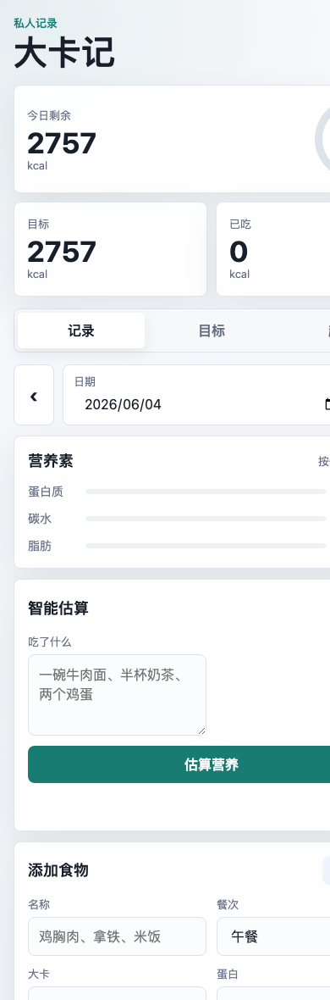

# 大卡记


一个为个人日常使用设计的 iPhone PWA 大卡摄入记录工具。它可以计算目标热量，记录每天吃了什么，追踪蛋白、碳水、脂肪，也可以通过 DeepSeek 代理估算食物营养范围。

> 数据默认保存在浏览器本地。DeepSeek API Key 不会写进前端，需要通过自己的 Cloudflare Worker 代理使用。

## Demo

[https://soybean2002.github.io/calorie-pwa/](https://soybean2002.github.io/calorie-pwa/)



## 功能

- 目标热量计算：BMR、TDEE、减脂/维持/增肌目标
- 手动营养素目标：自定义蛋白、碳水、脂肪目标
- 每日记录：按日期记录食物、餐次、热量和三大营养素
- 智能估算：输入“一碗牛肉面”这类自然语言，由 DeepSeek 返回热量与营养范围
- 7 天趋势：快速查看最近一周摄入变化
- 本地优先：数据默认存在当前浏览器本地
- JSON 备份：导出/导入本地数据
- 可选同步：配置自己的同步接口后，每次添加记录会自动 POST 到你的服务端
- PWA 支持：可添加到 iPhone 主屏幕，支持基础离线缓存

## 项目结构

```text
.
├── index.html              # 应用页面
├── styles.css              # 移动端 UI 样式
├── app.js                  # 计算、记录、PWA 交互逻辑
├── sw.js                   # Service Worker 离线缓存
├── manifest.webmanifest    # PWA Manifest
├── icons/                  # 主屏幕图标
└── deepseek-proxy/         # Cloudflare Worker 代理模板
```

## 本地运行

```bash
cd calorie-pwa
python3 -m http.server 4173
```

然后打开：

```text
http://127.0.0.1:4173/
```

## 部署到 GitHub Pages

1. 创建 GitHub 仓库
2. 推送代码到 `main`
3. 打开仓库 `Settings -> Pages`
4. Source 选择 `Deploy from a branch`
5. Branch 选择 `main`，Folder 选择 `/root`
6. 保存后等待部署完成

部署完成后，Safari 打开 HTTPS 地址，点击分享按钮，选择“添加到主屏幕”。

## 配置 DeepSeek 估算

不要把 DeepSeek API Key 写进 `app.js`、`index.html` 或 GitHub Pages。推荐部署：

[deepseek-proxy/worker.js](deepseek-proxy/worker.js)

到 Cloudflare Worker，把 API Key 放在 Worker 的 Secret 里。

Worker 部署完成后，在应用里打开：

```text
趋势 -> 数据 -> DeepSeek 代理地址
```

填入：

```text
https://your-worker.your-account.workers.dev/estimate
```

也可以用配置链接自动保存代理地址：

```text
https://soybean2002.github.io/calorie-pwa/?proxy=https%3A%2F%2Fyour-worker.your-account.workers.dev%2Festimate
```

如果你为 `/estimate` 设置了访问 token，也可以把 token 放在查询参数里：

```text
https://your-worker.your-account.workers.dev/estimate?token=your-secret-token
```

## 配置记录同步

默认情况下，所有记录只保存在当前浏览器本地。如果你想每次点“添加”后同步到自己的服务端：

```text
趋势 -> 数据 -> 记录同步地址
```

填入：

```text
https://your-worker.your-account.workers.dev/log?token=your-sync-token
```

Cloudflare Worker 模板已内置：

- `POST /log`：保存记录
- `GET /logs`：查看最近记录

详见 [deepseek-proxy/README.md](deepseek-proxy/README.md)。

## 隐私与安全

- 食物记录默认只保存在本机浏览器 `localStorage`
- DeepSeek API Key 只能放在 Cloudflare Worker Secret 中
- 公开仓库不要提交真实 API Key、真实同步 token 或私密 Worker 地址
- 如果开启同步，记录会发送到你配置的同步接口
- 清除 Safari 网站数据或删除主屏幕 App 可能导致本地数据丢失，请定期导出 JSON 备份

## 技术栈

- HTML / CSS / JavaScript
- PWA Manifest + Service Worker
- Cloudflare Worker
- Cloudflare KV，可选
- DeepSeek Chat Completions API，可选

## Roadmap

- [ ] 食物快捷收藏
- [ ] CSV 导出
- [ ] 月度统计
- [ ] 体重趋势
- [ ] 更细的餐次统计

## License

[MIT](LICENSE)
